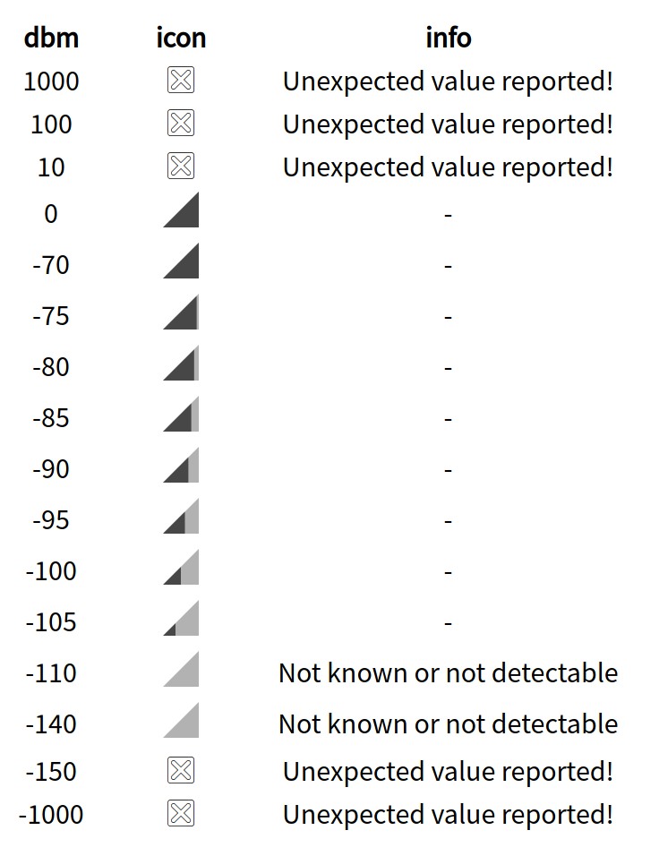

# RSRP Bar 

React component to render an RSRP bar or a failover icon in case the reported
value is not valid.

## Installation

    npm i --save-dev @bifravst/rsrp-bar

## Usage

See [`./src/demo.tsx`](./src/demo.tsx) for an example.

## Demo

    npm start
