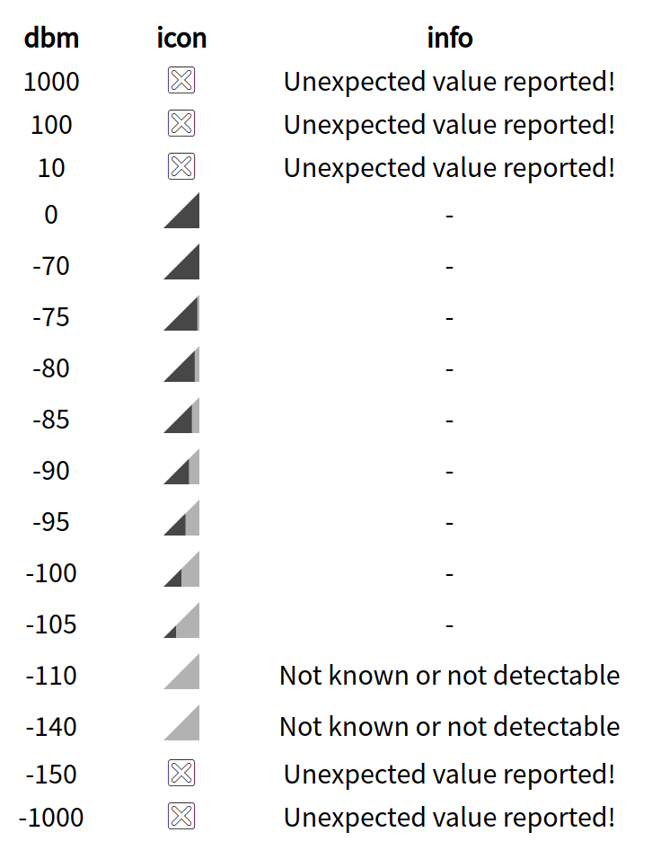

# RSRP Bar 

React component to render an RSRP bar or a failover icon in case the reported
value is not valid.

## Installation

    npm i --save-dev --save-exact @bifravst/rsrp-bar

## Usage

See [`./src/demo.tsx`](./src/demo.tsx) for an example.

## Demo

    npm start

## Node & NPM

This project requires Node.js `>=24.19.0 <25` and npm `>=12.0.2 <13` (enforced
via `check-node-version` on `npm install` and `npm ci`).

The check is skipped during `npm publish` and `npm pack`, because
`semantic-release` bundles its own npm (`@semantic-release/npm` depends on
`npm@^11.6.2`) and runs the publish with that version rather than the one
installed in CI.

## TypeScript 6 and 7

This repo
[runs TypeScript 6 and 7 side by side](https://devblogs.microsoft.com/typescript/announcing-typescript-7-0/#running-side-by-side-with-typescript-6.0),
[so that eslint works](https://github.com/typescript-eslint/typescript-eslint/issues/10940#issuecomment-4922812181).
